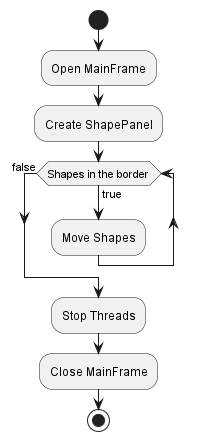
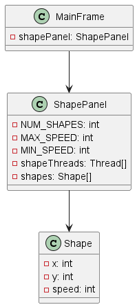
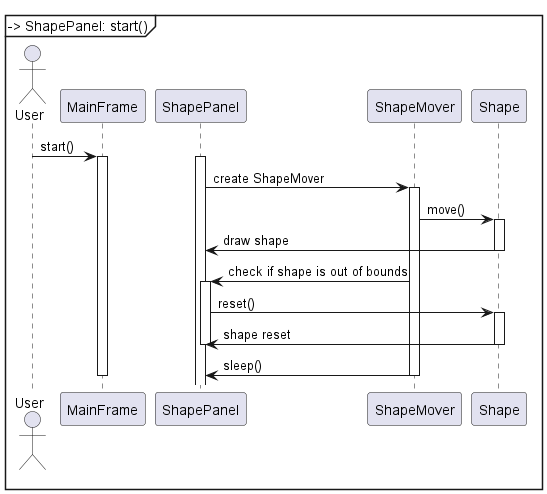

# Activity diagram 
\
# Class diagram
\
# Sequence Diagram

# 3.3 Application 3:

3.3.1 Requirements: To implement in Java 2 SE an application that has three threads of execution.

3.3.2 Specifications:

1. The application will be implemented in Java 2 SE.

2. The application has a graphical user interface in where three geometric shapes (for example, squares) will be added, initially arranged at the top of the window.

3. Each thread of execution is responsible for moving the squares, towards the bottom of the window, with a constant speed, randomly calculated (between a minimum and a maximum) for each square.

4. The threads of execution will be stopped when the geometric shapes exit the window perimeter. For stopping the threads, the stop() method will be defined, which will use a logical variable. This game should be resumed three times by crating other threads of execution for the new squares each time.

3.3.3 What is required:

a) class diagram;

b) activity diagram;

c) sequence diagram;

d) source code.

3.3.4 Testing if the application:

• opens the graphical interface;

• creates the 3 geometric shapes;

• moves the 3 geometric shapes'

• performs the stopping of the threads with the defined stop() method.